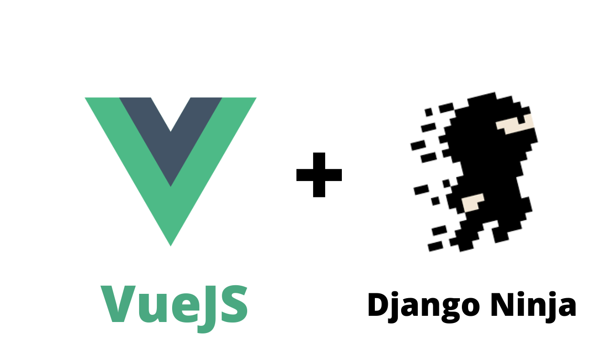

# Django Ninja Tutorial

Este é um tutorial do [Django Ninja](https://django-ninja.rest-framework.com/) usado na [Live](https://youtu.be/cZ7n3HN9MiU) no YouTube.

Frontend com VueJS: https://github.com/rg3915/regisdopython-vue




## Construindo uma API com Django Ninja

https://django-ninja.rest-framework.com/tutorial/


```
pip install django-ninja
```

```python
# api.py
from ninja import NinjaAPI

api = NinjaAPI()


@api.get("/hello")
def hello(request):
    return "Hello world"
```

```python
# urls.py
from django.contrib import admin
from django.urls import path
from .api import api

urlpatterns = [
    path("admin/", admin.site.urls),
    path("api/", api.urls),
]
```


## Este projeto foi feito com:

* [Python 3.9.4](https://www.python.org/)
* [Django 3.2.4](https://www.djangoproject.com/)
* [Django Ninja 0.13.1](https://www.django-rest-framework.org/)


## Como rodar o projeto?

* Clone esse repositório.
* Crie um virtualenv com Python 3.
* Ative o virtualenv.
* Instale as dependências.
* Rode as migrações.

```
git clone https://github.com/rg3915/django-ninja-tutorial.git
cd django-ninja-tutorial
python -m venv .venv
source .venv/bin/activate
pip install -r requirements.txt
python contrib/env_gen.py
python manage.py migrate
python manage.py createsuperuser --username="admin" --email=""
```

